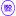
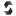
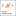
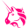

# Resized Icons

## activemq

| 16px | 32px | 48px | 64px | 128px | 256px | 512px |
|------|------|------|------|-------|-------|-------|
|  |  |

## allure_report

| 16px | 32px | 48px | 64px | 128px | 256px | 512px |
|------|------|------|------|-------|-------|-------|
|  |  |

## android

| 16px | 32px | 48px | 64px | 128px | 256px | 512px |
|------|------|------|------|-------|-------|-------|
|  |  |

## android_studio

| 16px | 32px | 48px | 64px | 128px | 256px | 512px |
|------|------|------|------|-------|-------|-------|
|  |  |

## angular

| 16px | 32px | 48px | 64px | 128px | 256px | 512px |
|------|------|------|------|-------|-------|-------|
|  |  |

## ansible

| 16px | 32px | 48px | 64px | 128px | 256px | 512px |
|------|------|------|------|-------|-------|-------|
|  |  |

## ant_design

| 16px | 32px | 48px | 64px | 128px | 256px | 512px |
|------|------|------|------|-------|-------|-------|
|  |  |

## apache_camel

| 16px | 32px | 48px | 64px | 128px | 256px | 512px |
|------|------|------|------|-------|-------|-------|
|  |  |

## apache_jmeter 

| 16px | 32px | 48px | 64px | 128px | 256px | 512px |
|------|------|------|------|-------|-------|-------|
|  |  |

## apache_solr

| 16px | 32px | 48px | 64px | 128px | 256px | 512px |
|------|------|------|------|-------|-------|-------|
|  |  |

## apache_spark

| 16px | 32px | 48px | 64px | 128px | 256px | 512px |
|------|------|------|------|-------|-------|-------|
|  |  |

## appcode

| 16px | 32px | 48px | 64px | 128px | 256px | 512px |
|------|------|------|------|-------|-------|-------|
|  |  |

## appium

| 16px | 32px | 48px | 64px | 128px | 256px | 512px |
|------|------|------|------|-------|-------|-------|
|  |  |

## appium_inspector

| 16px | 32px | 48px | 64px | 128px | 256px | 512px |
|------|------|------|------|-------|-------|-------|
|  |  |

## arch_linux

| 16px | 32px | 48px | 64px | 128px | 256px | 512px |
|------|------|------|------|-------|-------|-------|
|  |  |

## arduino

| 16px | 32px | 48px | 64px | 128px | 256px | 512px |
|------|------|------|------|-------|-------|-------|
|  |  |

## astro

| 16px | 32px | 48px | 64px | 128px | 256px | 512px |
|------|------|------|------|-------|-------|-------|
|  |  |

## atom

| 16px | 32px | 48px | 64px | 128px | 256px | 512px |
|------|------|------|------|-------|-------|-------|
|  |  |

## auth0

| 16px | 32px | 48px | 64px | 128px | 256px | 512px |
|------|------|------|------|-------|-------|-------|
|  |  |

## aws

| 16px | 32px | 48px | 64px | 128px | 256px | 512px |
|------|------|------|------|-------|-------|-------|
|  |  |

## babel

| 16px | 32px | 48px | 64px | 128px | 256px | 512px |
|------|------|------|------|-------|-------|-------|
|  |  |

## backbone_js

| 16px | 32px | 48px | 64px | 128px | 256px | 512px |
|------|------|------|------|-------|-------|-------|
|  |  |

## bash

| 16px | 32px | 48px | 64px | 128px | 256px | 512px |
|------|------|------|------|-------|-------|-------|
|  |  |

## bitbucket

| 16px | 32px | 48px | 64px | 128px | 256px | 512px |
|------|------|------|------|-------|-------|-------|
|  |  |

## bootstrap

| 16px | 32px | 48px | 64px | 128px | 256px | 512px |
|------|------|------|------|-------|-------|-------|
|  |  |

## browsersync

| 16px | 32px | 48px | 64px | 128px | 256px | 512px |
|------|------|------|------|-------|-------|-------|
|  |  |

## bulma

| 16px | 32px | 48px | 64px | 128px | 256px | 512px |
|------|------|------|------|-------|-------|-------|
|  |  |

## bun_js

| 16px | 32px | 48px | 64px | 128px | 256px | 512px |
|------|------|------|------|-------|-------|-------|
|  |  |

## c#

| 16px | 32px | 48px | 64px | 128px | 256px | 512px |
|------|------|------|------|-------|-------|-------|
|  |  |

## c++

| 16px | 32px | 48px | 64px | 128px | 256px | 512px |
|------|------|------|------|-------|-------|-------|
|  |  |

## c

| 16px | 32px | 48px | 64px | 128px | 256px | 512px |
|------|------|------|------|-------|-------|-------|
|  |  |

## canva

| 16px | 32px | 48px | 64px | 128px | 256px | 512px |
|------|------|------|------|-------|-------|-------|
|  |  |

## cassandra

| 16px | 32px | 48px | 64px | 128px | 256px | 512px |
|------|------|------|------|-------|-------|-------|
|  |  |

## chai

| 16px | 32px | 48px | 64px | 128px | 256px | 512px |
|------|------|------|------|-------|-------|-------|
|  |  |

## chainlink

| 16px | 32px | 48px | 64px | 128px | 256px | 512px |
|------|------|------|------|-------|-------|-------|
|  |  |

## chakra_ui

| 16px | 32px | 48px | 64px | 128px | 256px | 512px |
|------|------|------|------|-------|-------|-------|
|  |  |

## ci_cd

| 16px | 32px | 48px | 64px | 128px | 256px | 512px |
|------|------|------|------|-------|-------|-------|
|  |  |

## cockroachdb

| 16px | 32px | 48px | 64px | 128px | 256px | 512px |
|------|------|------|------|-------|-------|-------|
|  |  |

## consul

| 16px | 32px | 48px | 64px | 128px | 256px | 512px |
|------|------|------|------|-------|-------|-------|
|  |  |

## coral_ai

| 16px | 32px | 48px | 64px | 128px | 256px | 512px |
|------|------|------|------|-------|-------|-------|
|  |  |

## couchdb

| 16px | 32px | 48px | 64px | 128px | 256px | 512px |
|------|------|------|------|-------|-------|-------|
|  |  |

## css

| 16px | 32px | 48px | 64px | 128px | 256px | 512px |
|------|------|------|------|-------|-------|-------|
|  |  |

## cucumber

| 16px | 32px | 48px | 64px | 128px | 256px | 512px |
|------|------|------|------|-------|-------|-------|
|  |  |

## cypress

| 16px | 32px | 48px | 64px | 128px | 256px | 512px |
|------|------|------|------|-------|-------|-------|
|  |  |

## dart

| 16px | 32px | 48px | 64px | 128px | 256px | 512px |
|------|------|------|------|-------|-------|-------|
|  |  |

## databricks

| 16px | 32px | 48px | 64px | 128px | 256px | 512px |
|------|------|------|------|-------|-------|-------|
|  |  |

## digital_ocean

| 16px | 32px | 48px | 64px | 128px | 256px | 512px |
|------|------|------|------|-------|-------|-------|
|  |  |

## django

| 16px | 32px | 48px | 64px | 128px | 256px | 512px |
|------|------|------|------|-------|-------|-------|
|  |  |

## docker

| 16px | 32px | 48px | 64px | 128px | 256px | 512px |
|------|------|------|------|-------|-------|-------|
|  |  |

## eclipse

| 16px | 32px | 48px | 64px | 128px | 256px | 512px |
|------|------|------|------|-------|-------|-------|
|  |  |

## elasticsearch

| 16px | 32px | 48px | 64px | 128px | 256px | 512px |
|------|------|------|------|-------|-------|-------|
|  |  |

## elementary_os

| 16px | 32px | 48px | 64px | 128px | 256px | 512px |
|------|------|------|------|-------|-------|-------|
|  |  |

## elixir

| 16px | 32px | 48px | 64px | 128px | 256px | 512px |
|------|------|------|------|-------|-------|-------|
|  |  |

## ember_js

| 16px | 32px | 48px | 64px | 128px | 256px | 512px |
|------|------|------|------|-------|-------|-------|
|  |  |

## emqx

| 16px | 32px | 48px | 64px | 128px | 256px | 512px |
|------|------|------|------|-------|-------|-------|
|  |  |

## erlang

| 16px | 32px | 48px | 64px | 128px | 256px | 512px |
|------|------|------|------|-------|-------|-------|
|  |  |

## ethereum

| 16px | 32px | 48px | 64px | 128px | 256px | 512px |
|------|------|------|------|-------|-------|-------|
|  |  |

## express

| 16px | 32px | 48px | 64px | 128px | 256px | 512px |
|------|------|------|------|-------|-------|-------|
|  |  |

## fastify

| 16px | 32px | 48px | 64px | 128px | 256px | 512px |
|------|------|------|------|-------|-------|-------|
|  |  |

## fedora

| 16px | 32px | 48px | 64px | 128px | 256px | 512px |
|------|------|------|------|-------|-------|-------|
|  |  |

## figma

| 16px | 32px | 48px | 64px | 128px | 256px | 512px |
|------|------|------|------|-------|-------|-------|
|  |  |

## firebase

| 16px | 32px | 48px | 64px | 128px | 256px | 512px |
|------|------|------|------|-------|-------|-------|
|  |  |

## Firefox

| 16px | 32px | 48px | 64px | 128px | 256px | 512px |
|------|------|------|------|-------|-------|-------|
|  |  |

## flask

| 16px | 32px | 48px | 64px | 128px | 256px | 512px |
|------|------|------|------|-------|-------|-------|
|  |  |

## flutter

| 16px | 32px | 48px | 64px | 128px | 256px | 512px |
|------|------|------|------|-------|-------|-------|
|  |  |

## flyway

| 16px | 32px | 48px | 64px | 128px | 256px | 512px |
|------|------|------|------|-------|-------|-------|
|  |  |

## fortran

| 16px | 32px | 48px | 64px | 128px | 256px | 512px |
|------|------|------|------|-------|-------|-------|
|  |  |

## foundry

| 16px | 32px | 48px | 64px | 128px | 256px | 512px |
|------|------|------|------|-------|-------|-------|
|  |  |

## gatsby

| 16px | 32px | 48px | 64px | 128px | 256px | 512px |
|------|------|------|------|-------|-------|-------|
|  |  |

## gcp

| 16px | 32px | 48px | 64px | 128px | 256px | 512px |
|------|------|------|------|-------|-------|-------|
|  |  |

## git

| 16px | 32px | 48px | 64px | 128px | 256px | 512px |
|------|------|------|------|-------|-------|-------|
|  |  |

## github

| 16px | 32px | 48px | 64px | 128px | 256px | 512px |
|------|------|------|------|-------|-------|-------|
|  |  |

## gitlab

| 16px | 32px | 48px | 64px | 128px | 256px | 512px |
|------|------|------|------|-------|-------|-------|
|  |  |

## go

| 16px | 32px | 48px | 64px | 128px | 256px | 512px |
|------|------|------|------|-------|-------|-------|
|  |  |

## godot

| 16px | 32px | 48px | 64px | 128px | 256px | 512px |
|------|------|------|------|-------|-------|-------|
|  |  |

## google_chrome

| 16px | 32px | 48px | 64px | 128px | 256px | 512px |
|------|------|------|------|-------|-------|-------|
|  |  |

## graalvm

| 16px | 32px | 48px | 64px | 128px | 256px | 512px |
|------|------|------|------|-------|-------|-------|
|  |  |

## grafana

| 16px | 32px | 48px | 64px | 128px | 256px | 512px |
|------|------|------|------|-------|-------|-------|
|  |  |

## graphql

| 16px | 32px | 48px | 64px | 128px | 256px | 512px |
|------|------|------|------|-------|-------|-------|
|  |  |

## groovy

| 16px | 32px | 48px | 64px | 128px | 256px | 512px |
|------|------|------|------|-------|-------|-------|
|  |  |

## grpc

| 16px | 32px | 48px | 64px | 128px | 256px | 512px |
|------|------|------|------|-------|-------|-------|
|  |  |

## grunt

| 16px | 32px | 48px | 64px | 128px | 256px | 512px |
|------|------|------|------|-------|-------|-------|
|  |  |

## gulp

| 16px | 32px | 48px | 64px | 128px | 256px | 512px |
|------|------|------|------|-------|-------|-------|
|  |  |

## hadoop

| 16px | 32px | 48px | 64px | 128px | 256px | 512px |
|------|------|------|------|-------|-------|-------|
|  |  |

## hardhat

| 16px | 32px | 48px | 64px | 128px | 256px | 512px |
|------|------|------|------|-------|-------|-------|
|  |  |

## hazelcast

| 16px | 32px | 48px | 64px | 128px | 256px | 512px |
|------|------|------|------|-------|-------|-------|
|  |  |

## hibernate

| 16px | 32px | 48px | 64px | 128px | 256px | 512px |
|------|------|------|------|-------|-------|-------|
|  |  |

## hive

| 16px | 32px | 48px | 64px | 128px | 256px | 512px |
|------|------|------|------|-------|-------|-------|
|  |  |

## html

| 16px | 32px | 48px | 64px | 128px | 256px | 512px |
|------|------|------|------|-------|-------|-------|
|  |  |

## http

| 16px | 32px | 48px | 64px | 128px | 256px | 512px |
|------|------|------|------|-------|-------|-------|
|  |  |

## ibm_cloud

| 16px | 32px | 48px | 64px | 128px | 256px | 512px |
|------|------|------|------|-------|-------|-------|
|  |  |

## intellij

| 16px | 32px | 48px | 64px | 128px | 256px | 512px |
|------|------|------|------|-------|-------|-------|
|  |  |

## ios

| 16px | 32px | 48px | 64px | 128px | 256px | 512px |
|------|------|------|------|-------|-------|-------|
|  |  |

## iso

| 16px | 32px | 48px | 64px | 128px | 256px | 512px |
|------|------|------|------|-------|-------|-------|
|  |  |

## ISO_20022

| 16px | 32px | 48px | 64px | 128px | 256px | 512px |
|------|------|------|------|-------|-------|-------|
|  |  |

## java

| 16px | 32px | 48px | 64px | 128px | 256px | 512px |
|------|------|------|------|-------|-------|-------|
|  |  |

## javascript

| 16px | 32px | 48px | 64px | 128px | 256px | 512px |
|------|------|------|------|-------|-------|-------|
|  |  |

## jboss

| 16px | 32px | 48px | 64px | 128px | 256px | 512px |
|------|------|------|------|-------|-------|-------|
|  |  |

## jenkins

| 16px | 32px | 48px | 64px | 128px | 256px | 512px |
|------|------|------|------|-------|-------|-------|
|  |  |

## jest

| 16px | 32px | 48px | 64px | 128px | 256px | 512px |
|------|------|------|------|-------|-------|-------|
|  |  |

## jetty

| 16px | 32px | 48px | 64px | 128px | 256px | 512px |
|------|------|------|------|-------|-------|-------|
|  |  |

## jira

| 16px | 32px | 48px | 64px | 128px | 256px | 512px |
|------|------|------|------|-------|-------|-------|
|  |  |

## junit

| 16px | 32px | 48px | 64px | 128px | 256px | 512px |
|------|------|------|------|-------|-------|-------|
|  |  |

## jupyter_notebook

| 16px | 32px | 48px | 64px | 128px | 256px | 512px |
|------|------|------|------|-------|-------|-------|
|  |  |

## kafka

| 16px | 32px | 48px | 64px | 128px | 256px | 512px |
|------|------|------|------|-------|-------|-------|
|  |  |

## kali_linux

| 16px | 32px | 48px | 64px | 128px | 256px | 512px |
|------|------|------|------|-------|-------|-------|
|  |  |

## katalon

| 16px | 32px | 48px | 64px | 128px | 256px | 512px |
|------|------|------|------|-------|-------|-------|
|  |  |

## KiCad-Logo

| 16px | 32px | 48px | 64px | 128px | 256px | 512px |
|------|------|------|------|-------|-------|-------|
|  |  |

## kotlin

| 16px | 32px | 48px | 64px | 128px | 256px | 512px |
|------|------|------|------|-------|-------|-------|
|  |  |

## kubernetes

| 16px | 32px | 48px | 64px | 128px | 256px | 512px |
|------|------|------|------|-------|-------|-------|
|  |  |

## laravel

| 16px | 32px | 48px | 64px | 128px | 256px | 512px |
|------|------|------|------|-------|-------|-------|
|  |  |

## linux

| 16px | 32px | 48px | 64px | 128px | 256px | 512px |
|------|------|------|------|-------|-------|-------|
|  |  |

## linux_mint

| 16px | 32px | 48px | 64px | 128px | 256px | 512px |
|------|------|------|------|-------|-------|-------|
|  |  |

## liquibase

| 16px | 32px | 48px | 64px | 128px | 256px | 512px |
|------|------|------|------|-------|-------|-------|
|  |  |

## loki

| 16px | 32px | 48px | 64px | 128px | 256px | 512px |
|------|------|------|------|-------|-------|-------|
|  |  |

## lombok

| 16px | 32px | 48px | 64px | 128px | 256px | 512px |
|------|------|------|------|-------|-------|-------|
|  |  |

## lua

| 16px | 32px | 48px | 64px | 128px | 256px | 512px |
|------|------|------|------|-------|-------|-------|
|  |  |

## macos

| 16px | 32px | 48px | 64px | 128px | 256px | 512px |
|------|------|------|------|-------|-------|-------|
|  |  |

## mapstruct

| 16px | 32px | 48px | 64px | 128px | 256px | 512px |
|------|------|------|------|-------|-------|-------|
|  |  |

## mariadb

| 16px | 32px | 48px | 64px | 128px | 256px | 512px |
|------|------|------|------|-------|-------|-------|
|  |  |

## marionette

| 16px | 32px | 48px | 64px | 128px | 256px | 512px |
|------|------|------|------|-------|-------|-------|
|  |  |

## materialize

| 16px | 32px | 48px | 64px | 128px | 256px | 512px |
|------|------|------|------|-------|-------|-------|
|  |  |

## material_design

| 16px | 32px | 48px | 64px | 128px | 256px | 512px |
|------|------|------|------|-------|-------|-------|
|  |  |

## material_ui

| 16px | 32px | 48px | 64px | 128px | 256px | 512px |
|------|------|------|------|-------|-------|-------|
|  |  |

## matlab

| 16px | 32px | 48px | 64px | 128px | 256px | 512px |
|------|------|------|------|-------|-------|-------|
|  |  |

## maven

| 16px | 32px | 48px | 64px | 128px | 256px | 512px |
|------|------|------|------|-------|-------|-------|
|  |  |

## metamask

| 16px | 32px | 48px | 64px | 128px | 256px | 512px |
|------|------|------|------|-------|-------|-------|
|  |  |

## microfocus

| 16px | 32px | 48px | 64px | 128px | 256px | 512px |
|------|------|------|------|-------|-------|-------|
|  |  |

## micrometer

| 16px | 32px | 48px | 64px | 128px | 256px | 512px |
|------|------|------|------|-------|-------|-------|
|  |  |

## micronaut

| 16px | 32px | 48px | 64px | 128px | 256px | 512px |
|------|------|------|------|-------|-------|-------|
|  |  |

## microsoft_azure

| 16px | 32px | 48px | 64px | 128px | 256px | 512px |
|------|------|------|------|-------|-------|-------|
|  |  |

## mocha

| 16px | 32px | 48px | 64px | 128px | 256px | 512px |
|------|------|------|------|-------|-------|-------|
|  |  |

## mocikto

| 16px | 32px | 48px | 64px | 128px | 256px | 512px |
|------|------|------|------|-------|-------|-------|
|  |  |

## mongodb

| 16px | 32px | 48px | 64px | 128px | 256px | 512px |
|------|------|------|------|-------|-------|-------|
|  |

## mosquitto

| 16px | 32px | 48px | 64px | 128px | 256px | 512px |
|------|------|------|------|-------|-------|-------|
|  |  |

## mqtt

| 16px | 32px | 48px | 64px | 128px | 256px | 512px |
|------|------|------|------|-------|-------|-------|
|  |  |

## mqtt_js

| 16px | 32px | 48px | 64px | 128px | 256px | 512px |
|------|------|------|------|-------|-------|-------|
|  |  |

## mssql

| 16px | 32px | 48px | 64px | 128px | 256px | 512px |
|------|------|------|------|-------|-------|-------|
|  |  |

## mysql

| 16px | 32px | 48px | 64px | 128px | 256px | 512px |
|------|------|------|------|-------|-------|-------|
|  |  |

## neo4j

| 16px | 32px | 48px | 64px | 128px | 256px | 512px |
|------|------|------|------|-------|-------|-------|
|  |  |

## neovim

| 16px | 32px | 48px | 64px | 128px | 256px | 512px |
|------|------|------|------|-------|-------|-------|
|  |  |

## nest_js

| 16px | 32px | 48px | 64px | 128px | 256px | 512px |
|------|------|------|------|-------|-------|-------|
|  |  |

## next_js

| 16px | 32px | 48px | 64px | 128px | 256px | 512px |
|------|------|------|------|-------|-------|-------|
|  |  |

## next_ui

| 16px | 32px | 48px | 64px | 128px | 256px | 512px |
|------|------|------|------|-------|-------|-------|
|  |  |

## nginx

| 16px | 32px | 48px | 64px | 128px | 256px | 512px |
|------|------|------|------|-------|-------|-------|
|  |  |

## nodegui

| 16px | 32px | 48px | 64px | 128px | 256px | 512px |
|------|------|------|------|-------|-------|-------|
|  |  |

## node_js

| 16px | 32px | 48px | 64px | 128px | 256px | 512px |
|------|------|------|------|-------|-------|-------|
|  |  |

## npm

| 16px | 32px | 48px | 64px | 128px | 256px | 512px |
|------|------|------|------|-------|-------|-------|
|  |  |

## numpy

| 16px | 32px | 48px | 64px | 128px | 256px | 512px |
|------|------|------|------|-------|-------|-------|
|  |  |

## nuxt_js

| 16px | 32px | 48px | 64px | 128px | 256px | 512px |
|------|------|------|------|-------|-------|-------|
|  |  |

## odoo

| 16px | 32px | 48px | 64px | 128px | 256px | 512px |
|------|------|------|------|-------|-------|-------|
|  |  |

## openresty

| 16px | 32px | 48px | 64px | 128px | 256px | 512px |
|------|------|------|------|-------|-------|-------|
|  |  |

## opentext

| 16px | 32px | 48px | 64px | 128px | 256px | 512px |
|------|------|------|------|-------|-------|-------|
|  |  |

## oracle

| 16px | 32px | 48px | 64px | 128px | 256px | 512px |
|------|------|------|------|-------|-------|-------|
|  |  |

## pandas

| 16px | 32px | 48px | 64px | 128px | 256px | 512px |
|------|------|------|------|-------|-------|-------|
|  |  |

## php

| 16px | 32px | 48px | 64px | 128px | 256px | 512px |
|------|------|------|------|-------|-------|-------|
|  |  |

## phpstorm

| 16px | 32px | 48px | 64px | 128px | 256px | 512px |
|------|------|------|------|-------|-------|-------|
|  |  |

## php_(elephpant)

| 16px | 32px | 48px | 64px | 128px | 256px | 512px |
|------|------|------|------|-------|-------|-------|
| _16.png) | _32.png) |

## playwright

| 16px | 32px | 48px | 64px | 128px | 256px | 512px |
|------|------|------|------|-------|-------|-------|
|  |  |

## play_framework

| 16px | 32px | 48px | 64px | 128px | 256px | 512px |
|------|------|------|------|-------|-------|-------|
|  |  |

## postgresql

| 16px | 32px | 48px | 64px | 128px | 256px | 512px |
|------|------|------|------|-------|-------|-------|
|  |  |

## postman

| 16px | 32px | 48px | 64px | 128px | 256px | 512px |
|------|------|------|------|-------|-------|-------|
|  |  |

## prometheus

| 16px | 32px | 48px | 64px | 128px | 256px | 512px |
|------|------|------|------|-------|-------|-------|
|  |  |

## pug

| 16px | 32px | 48px | 64px | 128px | 256px | 512px |
|------|------|------|------|-------|-------|-------|
|  |  |

## puppet

| 16px | 32px | 48px | 64px | 128px | 256px | 512px |
|------|------|------|------|-------|-------|-------|
|  |  |

## puppeteer

| 16px | 32px | 48px | 64px | 128px | 256px | 512px |
|------|------|------|------|-------|-------|-------|
|  |  |

## pycharm

| 16px | 32px | 48px | 64px | 128px | 256px | 512px |
|------|------|------|------|-------|-------|-------|
|  |  |

## pygame

| 16px | 32px | 48px | 64px | 128px | 256px | 512px |
|------|------|------|------|-------|-------|-------|
|  |  |

## pytest

| 16px | 32px | 48px | 64px | 128px | 256px | 512px |
|------|------|------|------|-------|-------|-------|
|  |  |

## python

| 16px | 32px | 48px | 64px | 128px | 256px | 512px |
|------|------|------|------|-------|-------|-------|
|  |  |

## qt

| 16px | 32px | 48px | 64px | 128px | 256px | 512px |
|------|------|------|------|-------|-------|-------|
|  |  |

## quarkus

| 16px | 32px | 48px | 64px | 128px | 256px | 512px |
|------|------|------|------|-------|-------|-------|
|  |  |

## rabbitmq

| 16px | 32px | 48px | 64px | 128px | 256px | 512px |
|------|------|------|------|-------|-------|-------|
|  |  |

## raspberri_pi

| 16px | 32px | 48px | 64px | 128px | 256px | 512px |
|------|------|------|------|-------|-------|-------|
|  |  |

## react

| 16px | 32px | 48px | 64px | 128px | 256px | 512px |
|------|------|------|------|-------|-------|-------|
|  |  |

## react_query

| 16px | 32px | 48px | 64px | 128px | 256px | 512px |
|------|------|------|------|-------|-------|-------|
|  |  |

## realm

| 16px | 32px | 48px | 64px | 128px | 256px | 512px |
|------|------|------|------|-------|-------|-------|
|  |  |

## redis

| 16px | 32px | 48px | 64px | 128px | 256px | 512px |
|------|------|------|------|-------|-------|-------|
|  |  |

## redux

| 16px | 32px | 48px | 64px | 128px | 256px | 512px |
|------|------|------|------|-------|-------|-------|
|  |  |

## rest

| 16px | 32px | 48px | 64px | 128px | 256px | 512px |
|------|------|------|------|-------|-------|-------|
|  |  |

## robot_framework

| 16px | 32px | 48px | 64px | 128px | 256px | 512px |
|------|------|------|------|-------|-------|-------|
|  |  |

## rpg_maker

| 16px | 32px | 48px | 64px | 128px | 256px | 512px |
|------|------|------|------|-------|-------|-------|
|  |  |

## ruby

| 16px | 32px | 48px | 64px | 128px | 256px | 512px |
|------|------|------|------|-------|-------|-------|
|  |  |

## rubygems

| 16px | 32px | 48px | 64px | 128px | 256px | 512px |
|------|------|------|------|-------|-------|-------|
|  |  |

## ruby_on_rails

| 16px | 32px | 48px | 64px | 128px | 256px | 512px |
|------|------|------|------|-------|-------|-------|
|  |  |

## rust

| 16px | 32px | 48px | 64px | 128px | 256px | 512px |
|------|------|------|------|-------|-------|-------|
|  |  |

## sass

| 16px | 32px | 48px | 64px | 128px | 256px | 512px |
|------|------|------|------|-------|-------|-------|
|  |  |

## sbt

| 16px | 32px | 48px | 64px | 128px | 256px | 512px |
|------|------|------|------|-------|-------|-------|
|  |  |

## scala

| 16px | 32px | 48px | 64px | 128px | 256px | 512px |
|------|------|------|------|-------|-------|-------|
|  |  |

## selenium

| 16px | 32px | 48px | 64px | 128px | 256px | 512px |
|------|------|------|------|-------|-------|-------|
|  |  |

## shadcn_ui

| 16px | 32px | 48px | 64px | 128px | 256px | 512px |
|------|------|------|------|-------|-------|-------|
|  |  |

## soap

| 16px | 32px | 48px | 64px | 128px | 256px | 512px |
|------|------|------|------|-------|-------|-------|
|  |  |

## solana

| 16px | 32px | 48px | 64px | 128px | 256px | 512px |
|------|------|------|------|-------|-------|-------|
|  |  |

## solidity

| 16px | 32px | 48px | 64px | 128px | 256px | 512px |
|------|------|------|------|-------|-------|-------|
|  |  |

## sonarqube

| 16px | 32px | 48px | 64px | 128px | 256px | 512px |
|------|------|------|------|-------|-------|-------|
|  |  |

## spock

| 16px | 32px | 48px | 64px | 128px | 256px | 512px |
|------|------|------|------|-------|-------|-------|
|  |  |

## spring

| 16px | 32px | 48px | 64px | 128px | 256px | 512px |
|------|------|------|------|-------|-------|-------|
|  |  |

## spring_boot

| 16px | 32px | 48px | 64px | 128px | 256px | 512px |
|------|------|------|------|-------|-------|-------|
|  |  |

## spyder

| 16px | 32px | 48px | 64px | 128px | 256px | 512px |
|------|------|------|------|-------|-------|-------|
|  |  |

## sqlite

| 16px | 32px | 48px | 64px | 128px | 256px | 512px |
|------|------|------|------|-------|-------|-------|
|  |  |

## strapi

| 16px | 32px | 48px | 64px | 128px | 256px | 512px |
|------|------|------|------|-------|-------|-------|
|  |  |

## struts

| 16px | 32px | 48px | 64px | 128px | 256px | 512px |
|------|------|------|------|-------|-------|-------|
|  |  |

## styled-components

| 16px | 32px | 48px | 64px | 128px | 256px | 512px |
|------|------|------|------|-------|-------|-------|
|  |  |

## sublime_text

| 16px | 32px | 48px | 64px | 128px | 256px | 512px |
|------|------|------|------|-------|-------|-------|
|  |  |

## supabase

| 16px | 32px | 48px | 64px | 128px | 256px | 512px |
|------|------|------|------|-------|-------|-------|
|  |  |

## svelte

| 16px | 32px | 48px | 64px | 128px | 256px | 512px |
|------|------|------|------|-------|-------|-------|
|  |  |

## swagger

| 16px | 32px | 48px | 64px | 128px | 256px | 512px |
|------|------|------|------|-------|-------|-------|
|  |  |

## swift

| 16px | 32px | 48px | 64px | 128px | 256px | 512px |
|------|------|------|------|-------|-------|-------|
|  |  |

## tailwind_css

| 16px | 32px | 48px | 64px | 128px | 256px | 512px |
|------|------|------|------|-------|-------|-------|
|  |  |

## tensorflow

| 16px | 32px | 48px | 64px | 128px | 256px | 512px |
|------|------|------|------|-------|-------|-------|
|  |  |

## terraform

| 16px | 32px | 48px | 64px | 128px | 256px | 512px |
|------|------|------|------|-------|-------|-------|
|  |  |

## testcontainers

| 16px | 32px | 48px | 64px | 128px | 256px | 512px |
|------|------|------|------|-------|-------|-------|
|  |  |

## thanos

| 16px | 32px | 48px | 64px | 128px | 256px | 512px |
|------|------|------|------|-------|-------|-------|
|  |  |

## tomcat

| 16px | 32px | 48px | 64px | 128px | 256px | 512px |
|------|------|------|------|-------|-------|-------|
|  |  |

## trpc

| 16px | 32px | 48px | 64px | 128px | 256px | 512px |
|------|------|------|------|-------|-------|-------|
|  |  |

## turborepo

| 16px | 32px | 48px | 64px | 128px | 256px | 512px |
|------|------|------|------|-------|-------|-------|
|  |  |

## typescript

| 16px | 32px | 48px | 64px | 128px | 256px | 512px |
|------|------|------|------|-------|-------|-------|
|  |  |

## ubuntu

| 16px | 32px | 48px | 64px | 128px | 256px | 512px |
|------|------|------|------|-------|-------|-------|
|  |  |

## uniswap

| 16px | 32px | 48px | 64px | 128px | 256px | 512px |
|------|------|------|------|-------|-------|-------|
|  |  |

## unity

| 16px | 32px | 48px | 64px | 128px | 256px | 512px |
|------|------|------|------|-------|-------|-------|
|  |

## unreal_engine

| 16px | 32px | 48px | 64px | 128px | 256px | 512px |
|------|------|------|------|-------|-------|-------|
|  |

## vaadin

| 16px | 32px | 48px | 64px | 128px | 256px | 512px |
|------|------|------|------|-------|-------|-------|
|  |

## vault

| 16px | 32px | 48px | 64px | 128px | 256px | 512px |
|------|------|------|------|-------|-------|-------|
|  |

## vim

| 16px | 32px | 48px | 64px | 128px | 256px | 512px |
|------|------|------|------|-------|-------|-------|
|  |

## visual_studio_code

| 16px | 32px | 48px | 64px | 128px | 256px | 512px |
|------|------|------|------|-------|-------|-------|
|  |

## vite

| 16px | 32px | 48px | 64px | 128px | 256px | 512px |
|------|------|------|------|-------|-------|-------|
|  |

## vuetify_js

| 16px | 32px | 48px | 64px | 128px | 256px | 512px |
|------|------|------|------|-------|-------|-------|
|  |

## vue_js

| 16px | 32px | 48px | 64px | 128px | 256px | 512px |
|------|------|------|------|-------|-------|-------|
|  |

## webassembly

| 16px | 32px | 48px | 64px | 128px | 256px | 512px |
|------|------|------|------|-------|-------|-------|
|  |

## WebKit

| 16px | 32px | 48px | 64px | 128px | 256px | 512px |
|------|------|------|------|-------|-------|-------|
|  |

## webpack

| 16px | 32px | 48px | 64px | 128px | 256px | 512px |
|------|------|------|------|-------|-------|-------|
|  |

## websocket

| 16px | 32px | 48px | 64px | 128px | 256px | 512px |
|------|------|------|------|-------|-------|-------|
|  |

## webstorm

| 16px | 32px | 48px | 64px | 128px | 256px | 512px |
|------|------|------|------|-------|-------|-------|
|  |

## wildfly

| 16px | 32px | 48px | 64px | 128px | 256px | 512px |
|------|------|------|------|-------|-------|-------|
|  |

## windows

| 16px | 32px | 48px | 64px | 128px | 256px | 512px |
|------|------|------|------|-------|-------|-------|
|  |

## wix

| 16px | 32px | 48px | 64px | 128px | 256px | 512px |
|------|------|------|------|-------|-------|-------|
|  |

## wordpress

| 16px | 32px | 48px | 64px | 128px | 256px | 512px |
|------|------|------|------|-------|-------|-------|
|  |

## wxwidgets

| 16px | 32px | 48px | 64px | 128px | 256px | 512px |
|------|------|------|------|-------|-------|-------|
|  |

## xcode

| 16px | 32px | 48px | 64px | 128px | 256px | 512px |
|------|------|------|------|-------|-------|-------|
|  |

## yarn

| 16px | 32px | 48px | 64px | 128px | 256px | 512px |
|------|------|------|------|-------|-------|-------|
|  |

## zero_the_ziguana

| 16px | 32px | 48px | 64px | 128px | 256px | 512px |
|------|------|------|------|-------|-------|-------|
|  |

## ziglang

| 16px | 32px | 48px | 64px | 128px | 256px | 512px |
|------|------|------|------|-------|-------|-------|
|  |

## _net_core

| 16px | 32px | 48px | 64px | 128px | 256px | 512px |
|------|------|------|------|-------|-------|-------|
|  |

